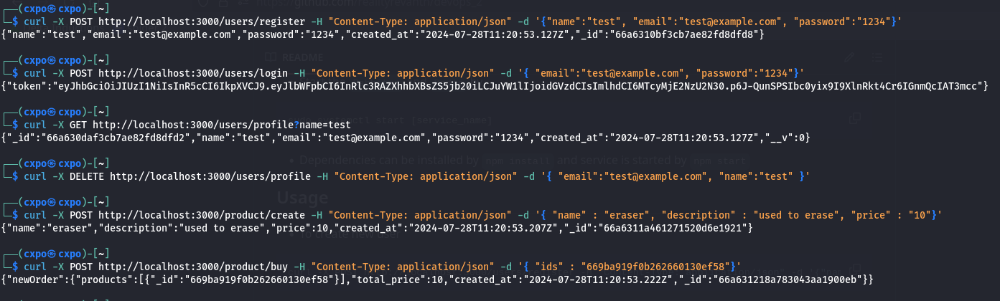

# DevOps Task - 2
- For backend, I used the [resources](https://github.com/UncleWeeds/spiderTask-2) given in the task pdf.
- I created the service images by separate dockerfile for each service with `alpine` as base image and installed `nodejs` and `npm` to run services.
- The whole setup is dockerised and can be deployed or restarted with latest images by running 
```bash
bash deploy.sh
```
>__Note__ : `deploy.sh` script uses `docker compose`(v2) not `docker-compose`(v1).
- This application requires `Rabbitmq` for transmitting messages between containers (i.e. product service and order service) and `Redis` for temporary db (or cache). Images are pulled automatically during setup.
- To see errors encountered or deployment details during setup, see `deploy.log`
- I also used `nginx` reverse proxy for directing requests to containers based on url path.
- Port `3000` is used for listening and accepting requests.

## Local setup 
- To setup locally without docker, you have to install `Rabbitmq` and `Redis` and change the hostname in js files from `rabbitmq` or `redis` to `localhost`.
- Start the `Rabbitmq` and  `Redis` by 
```bash
sudo systemctl start [service_name]
```
- Dependencies can be installed by `npm install` and service is started by `npm start`

## Usage
- To create new user
```bash
curl -X POST http://localhost:3000/users/register -H "Content-Type: application/json" -d '{"name":"test", "email":"test@example.com", "password":"1234"}'
```
- To login 
```bash
curl -X POST http://localhost:3000/users/login -H "Content-Type: application/json" -d '{ "email":"test@example.com", "password":"1234"}'
```

- To see user details
```bash
curl -X GET http://localhost:3000/users/profile?name=test
```

- To delete a user
```bash
curl -X DELETE http://localhost:3000/users/profile -H "Content-Type: application/json" -d '{ "email":"test@example.com", "name":"test" }'
```

- To create new product
```bash
curl -X POST http://localhost:3000/product/create -H "Content-Type: application/json" -d '{ "name" : "eraser", "description" : "used to erase", "price" : "10"}'
```

- To order a product
```bash
curl -X POST http://localhost:3000/product/buy -H "Content-Type: application/json" -d '{ "ids" : "669ba919f0b262660130ef58"}'
```
### Output of above requests:



## Compose Configuration
- To build the images, `Dockerfile` is configuration file.
- For running multiple containers at same time as cluster, `docker compose` is used with `compose.yaml` as configuration file.
- To persist data of `Rabbitmq` and `Redis`, volumes named `rabbitmq_db` and `redis_db` is created and mounted at respective directories of containers.
- Since services depend on `Rabbitmq` and `Redis`, `healthcheck` is performed on them to ensure status before starting servcies.

## CI/CD Setup and Automated Deployment
- Using Github workflow and actions, Docker images are built and pushed to Dockerhub using `docker/build-push-action@v6` action.
- Workflow consists of jobs and job is defined with steps.
- This workflow is triggered whenever there is commit on repo.
- To upload the images, login is needed which is done by `docker/login-action@v3` action using PAT(Personal Accesss Token) stored in Github secrets.
- Instead of installing `nodejs` and `npm` for each services, they are installed in `alpine_node` image and it is used for building service images.

